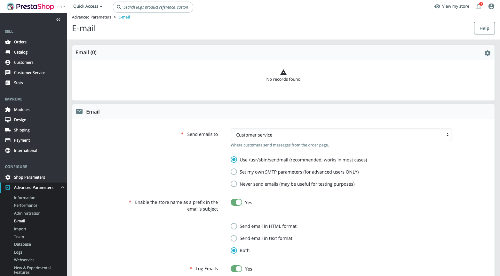

# Prestashop CI/CD pipeline

Deploy Prestashop server with CI/CD on Elestio

 
 

# Once deployed ...

You can open Prestashop here:

    URL: https://[CI_CD_DOMAIN]

Once the installation is complete, you can access your PrestaShop Admin dashboard at:

    URL: https://[CI_CD_DOMAIN]/admin_ps

## Configure Email configuration for Prestashop

Open the terminal or go to Tools in VS Code to launch the editor, then run the following commands.

    set -o allexport; source .env; set +o allexport;

    docker compose exec -it prestashop bin/console prestashop:config set PS_MAIL_SERVER --value "$PS_MAIL_SERVER"
    docker compose exec -it prestashop bin/console prestashop:config set PS_SHOP_EMAIL --value "$ADMIN_EMAIL"
    docker compose exec -it prestashop bin/console prestashop:config set PS_MAIL_USER --value "$PS_MAIL_USER"
    docker compose exec -it prestashop bin/console prestashop:config set PS_MAIL_PASSWD --value "$PS_MAIL_PASSWD"
    docker compose exec -it prestashop bin/console prestashop:config set PS_MAIL_SMTP_PORT --value "$PS_MAIL_SMTP_PORT"
    docker compose exec -it prestashop bin/console prestashop:config set PS_MAIL_SMTP_ENCRYPTION --value "tls"

After the email configuration is set, Log into your Prestashop Admin console, go to Advance Parameters on your Sidebar, select Email
Under Email Section, Choose `Set my Own SMTP Parameters (For Advance users only)` and save the configuration.

