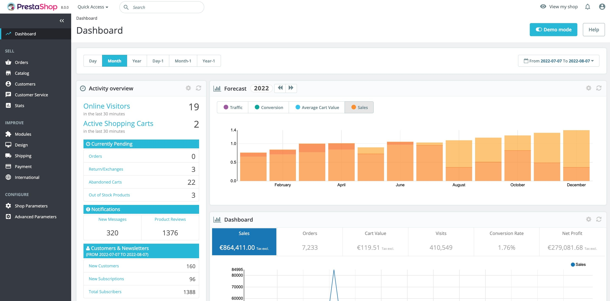

# Prestashop CI/CD pipeline

Deploy Prestashop server with CI/CD on Elestio

 
 

# Once deployed ...

You can open Prestashop here:

    URL: https://[CI_CD_DOMAIN]

You need to do go through the installation process.

- Under installation process make sure SSL/TLS is checked.
- In the database configuration step, update the host configuration from
    from `127.0.0.1` -> `172.17.0.1`
- And database Password as `[ADMIN_PASSWORD]` 

Once the installation is complete, you can access your PrestaShop Admin dashboard at:

    URL: https://[CI_CD_DOMAIN]/admin

Before opening the admin page, go to Tools > Open VS Code in your code editor and execute the following script to configure the email settings and remove the installation directory.